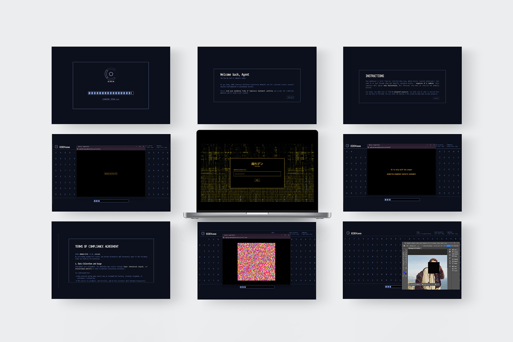

[![CC BY-NC-SA 4.0][cc-by-nc-sa-shield]][cc-by-nc-sa]

## Play the game

## Overview

EDEN.exe is a single-player investigative narrative game where truth hides behind firewalls, riddles, and forgotten data trails.

After receiving a cryptic journal from a missing colleague, Amira Berger, the player steps into the role of an agent in a world run by opaque systems and manipulated information. On the surface, your job is to process data, follow protocol, and comply. But if you pay attention and are willing to investigate further you’ll find that, buried in the noise, are fragments of a lost truth.

Through ciphers, coded websites, contradictory reports, and haunting pop-ups, the player uncovers the real story of the past 20 years, a history rewritten by the institutions that claimed to protect it. As the investigation deepens, so does the question: are you here to serve the system… or to expose it? Sometimes, to uncover the future, you must reassemble the past.

## Requirements

To experience the full game it is necessary to possess Amira Berger's Journal and Letter. You can download them in the <a href="https://authority-eden.github.io/eden.exe/#:~:text=Pick%20up%20your%20package" target="blank">game page</a> of Eden.exe.

## Credits

This is a project made for the course Complex Artifacts and System Design Studio for the Master's Degree in Communication Design.

### Group members

- Bertagnin Bianca
- Bissoli Miriam
- Casini Francesca
- Figueiredo Caeiro Alice
- Garipova Dariia
- De Jesus Pereira Beatriz Inês

_Polytechnic University of Milan  
School of Design  
Complex Artifacts and System Design Studio 
AY 2024 — 2025_

### Others

Music: <a href="https://freemusicarchive.org/music/Daniel_Birch/Ambient_Vol1/Forgotten_Landscape/" target="blank">Forgotten Landscape by Daniel Birch</a>
Font: <a href="https://velvetyne.fr/fonts/steps-mono/" target="blank">Steps Mono by Jean-Baptiste Morizot, Raphaël Bastide. Distributed by velvetyne.fr.</a>

### License

This work is licensed under a
[Creative Commons Attribution-NonCommercial-ShareAlike 4.0 International License][cc-by-nc-sa].

[![CC BY-NC-SA 4.0][cc-by-nc-sa-image]][cc-by-nc-sa]

[cc-by-nc-sa]: http://creativecommons.org/licenses/by-nc-sa/4.0/
[cc-by-nc-sa-image]: https://licensebuttons.net/l/by-nc-sa/4.0/88x31.png
[cc-by-nc-sa-shield]: https://img.shields.io/badge/License-CC%20BY--NC--SA%204.0-lightgrey.svg
