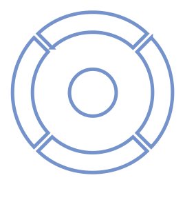

[![CC BY-NC-SA 4.0][cc-by-nc-sa-shield]][cc-by-nc-sa]

## Context

The year 2046. You are an Agent of The Authority, the world order that keeps you, your family and all of your data safe. You do not know the exact details of how this came to be, you were too young to remember. But you know of it, the Collapse, the rise of The Authority, and the better world it created for everyone, more peaceful, safe, and free.

You are relatively new to your job but you quickly made friends with another colleague of yours, Amira Berger. Someone who, now that you think of it… You have not seen in a while…

In any case there is no time to lose, you have to get going. As you leave home, you find a package waiting for you at your doorstep, looks like you’ve got mail. You pick it up and take it with you, you can check it out when you get to the office, after all, you don’t want to be late for work.

As you get your day started you repeat in your head everything you will need to know to access the platform:

USERNAME: anonagtzero

PASSWORD: /0penGate

Wouldn’t want to forget that...

---

### Group members

- Bertagnin Bianca
- Bissoli Miriam
- Casini Francesca
- Figueiredo Caeiro Alice
- Garipova Dariia
- Pereira De Jesus Beatriz Ines

_Polytechnic University of Milan  
School of Design  
Complex Artifacts and System Design Studio 
AY 2024 — 2025_

### License

This work is licensed under a
[Creative Commons Attribution-NonCommercial-ShareAlike 4.0 International License][cc-by-nc-sa].

[![CC BY-NC-SA 4.0][cc-by-nc-sa-image]][cc-by-nc-sa]

[cc-by-nc-sa]: http://creativecommons.org/licenses/by-nc-sa/4.0/
[cc-by-nc-sa-image]: https://licensebuttons.net/l/by-nc-sa/4.0/88x31.png
[cc-by-nc-sa-shield]: https://img.shields.io/badge/License-CC%20BY--NC--SA%204.0-lightgrey.svg
